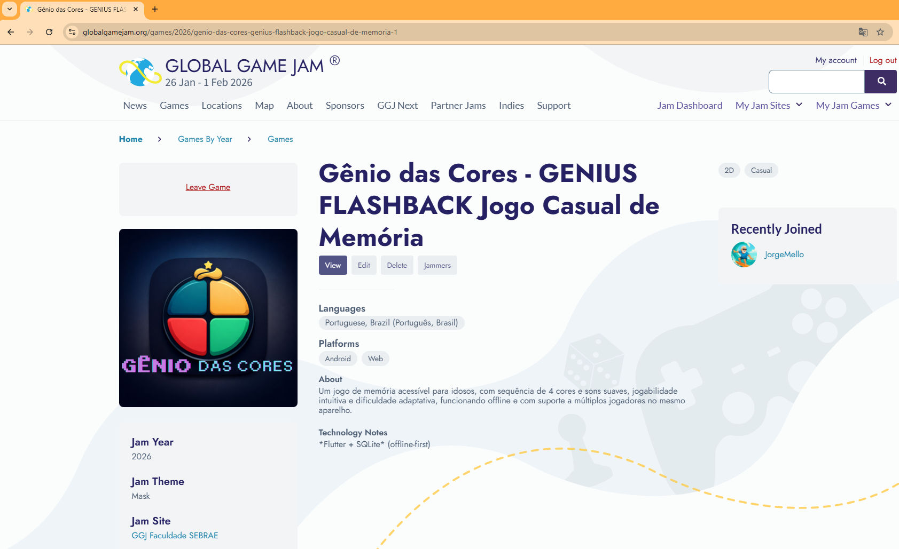
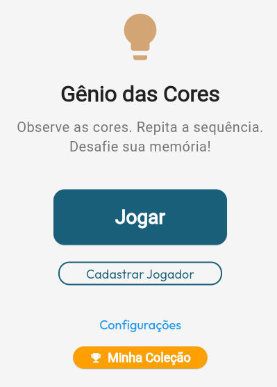
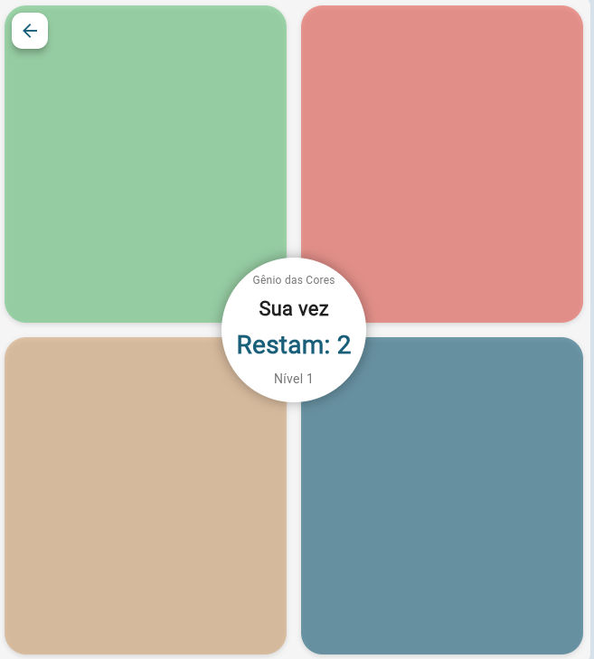

# Jogo Físico: GENIUS FLASHBACK transformado para o Digital e Acessível para a População Idosa
[GÊNIO DAS CORES - Visitar o Site do JOGO](https://jorgemello.github.io)

Protótipo do Jogo "Gênio das Cores" Jogo de memória desenvolvido em Flutter + SQLite (offline-first), projetado para idosos: botões grandes, feedback claro, sem pressa e com dificuldade adaptativa.

# Criado em 48h [GLOBAL GAME JAM - Visitar o Site do Projeto] (https://globalgamejam.org/games/2026/genio-das-cores-genius-flashback-jogo-casual-de-memoria-1)
Um jogo de memória acessível para idosos, com sequência de 4 cores e sons suaves, jogabilidade intuitiva e dificuldade adaptativa, funcionando offline e com suporte a múltiplos jogadores no mesmo aparelho.

[GÊNIO DAS CORES - Visitar o Site](https://jorgemello.github.io)

## TELA INICIAL DO JOGO

### TELA DO JOGO

# APK para instalar em ANDROID está com todas as funcionalidades (BREVE NA PLAYSTORE).
